<h1 align="center">Wildlyfe Blog</h1>

[View the live project here.]()

Wildlyfe is a blog application I have created to share, discuss, and engage with other wildlife enthusiasts that I have built using the Django Full Stack framework for my Portfolio Project 4

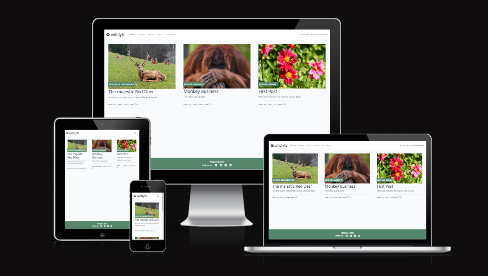

## Design & Planning:

### User Stories

 - #### First Time Visitor Goals

        - As a First Time Visitor, I want to easily understand the main purpose of the site.
        - As a First Time Visitor, I want to be able to easily navigate throughout the site to find content.
        - As a First Time Visitor, I want to be able to create an account.

- #### Returning Visitor Goals

        - As a Returning Visitor, I want to be able to log in/out.
        - As a Returning Visitor, I want to be able to see new posts.
        - As a Returning Visitor, I want to  be able to engage with others in a meaningful way.


- #### Frequent User Goals

        - As a Frequent User, I want to be kept up to date with a newsletter.
        - As a Frequent User, I want to take part in discussions and leave comments.
        - As a Frequent User, I want to be able to make my own posts.

### Design
-   #### Colour Scheme

        -   The two main colours used are a dark green, pale green, and a very dark grey for contrast.

-   #### Typography
        -   The Montserrat font is the main font used throughout the whole website with Sans Serif as the fallback font in case for any reason the font isn't being imported into the site correctly. Montserrat is a clean font used frequently in programming, so it is both attractive and appropriate.

-   #### Imagery
        -   Imagery is kept to a minimum to keep the users attention of posts, the intention is to guide them into engaging
        with posts by keeping them to focal point.

### Wireframes
<details>
<summary>Click here to view</summary>
<br>

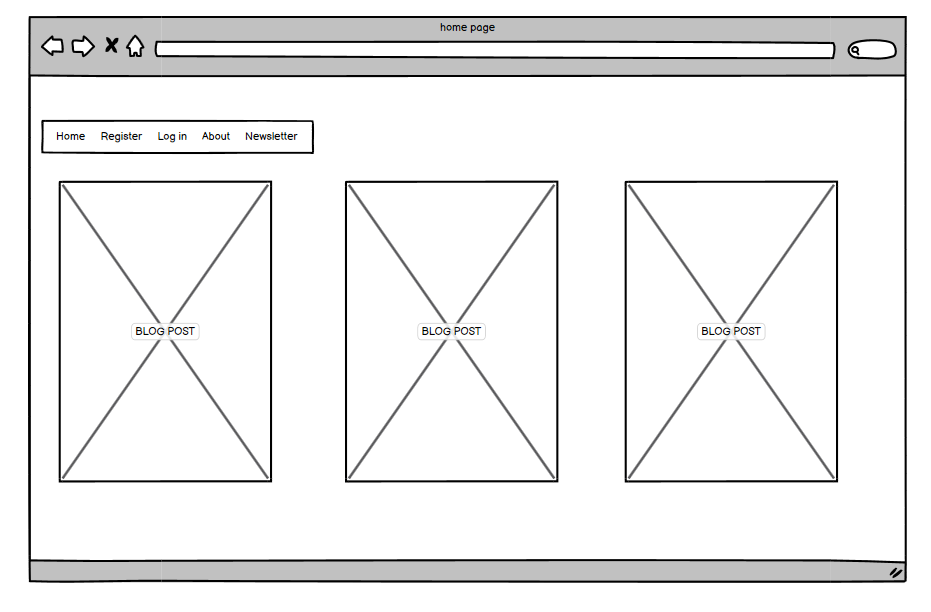

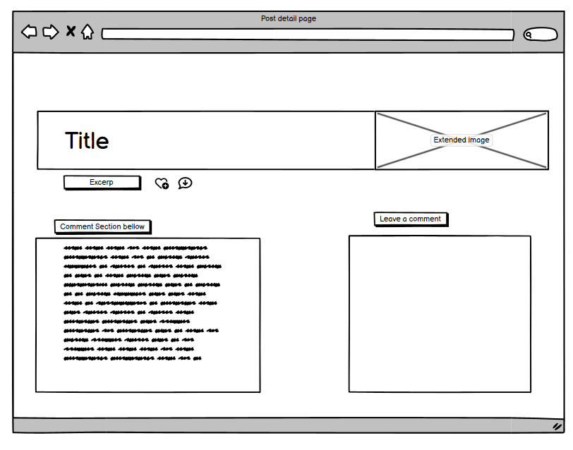

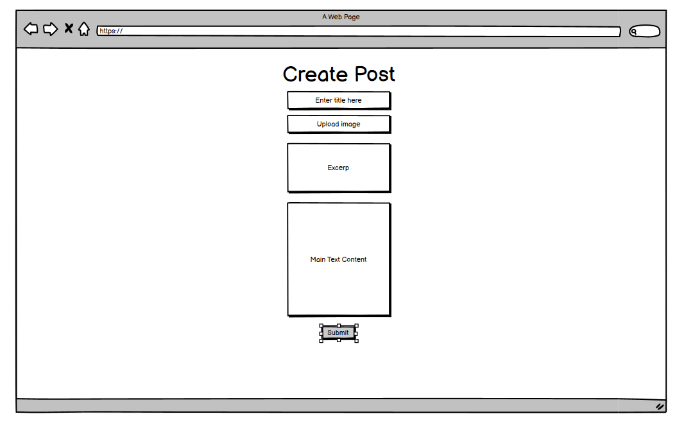

</details>

## Technologies Used

### Languages Used

-   [HTML5](https://en.wikipedia.org/wiki/HTML5)
-   [CSS3](https://en.wikipedia.org/wiki/Cascading_Style_Sheets)
-   [JavaScript](https://en.wikipedia.org/wiki/JavaScript)
-   [Python](https://en.wikipedia.org/wiki/Python_(programming_language))

### Frameworks, Libraries & Programs Used

1. [Bootstrap 4.4.1:](https://getbootstrap.com/docs/4.4/getting-started/introduction/)
    - Bootstrap was used to assist with the basic layout.
2. [GitHub:](https://github.com/)
    - GitHub is used to store the projects code after being pushed from Git.
3. [Balsamiq:](https://balsamiq.com/)
    - Balsamiq was used to create the wireframes during the design process.
4. [Django](https://www.djangoproject.com/)
    - Django was used for 
5. [Font Awesome:](https://fontawesome.com/)
    - Font Awesome was used on all pages throughout the website to add icons for aesthetic and UX purposes.

### Agile Methodology
The Agile Methodology was used to plan this project. I did learn more towards the end of the project about the use of the agile develepment, and why it's important and usefull to keep track of the whole process and to implement as much as you can. 
I've used Github and the Project Board with use of the Kanban board.

The project board was divided into 3 sections:

  -  To-Do- (All the User stories were initially entered in the 'To Do' column)
  -  In Progress- (then during development story they were moved into the 'In Progress' column)
  -  Done- (and then finally they get moved into 'Done' once the development completes)

<details>
<summary>Click here to view</summary>
<br>

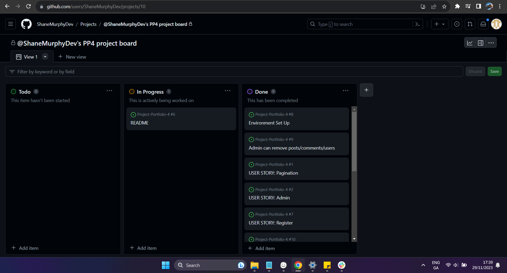

</details>


## Performance

### Google's Lighthouse Performance

[Google Lighthouse](https://developers.google.com/web/tools/lighthouse) was used to test the performance of the website.

<details>
<summary>Desktop</summary>
<br>

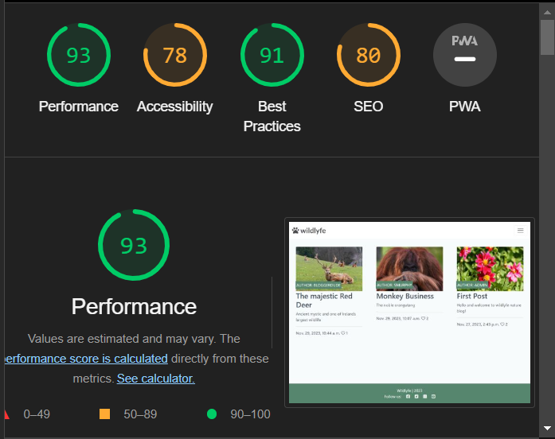

</details>

<details>
<summary>Mobile</summary>
<br>

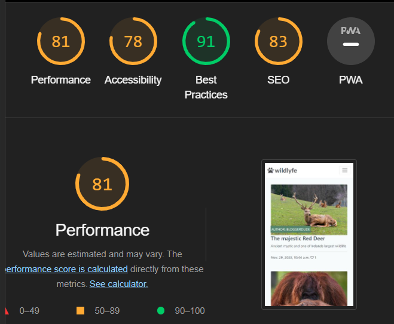

</details>

## Testing

The W3C Markup Validator and W3C CSS Validator Services were used to validate every page of the project to ensure there were no syntax errors in the project, there are however some errors in the bootstrap the do not effect the code or site.

-   [W3C Markup Validator](https://jigsaw.w3.org/css-validator/#validate_by_input)
-   [W3C CSS Validator](https://jigsaw.w3.org/css-validator/#validate_by_input)
-   [Python Linter](https://pep8ci.herokuapp.com/)

<details>
<summary>HTML Validation</summary>
<br>

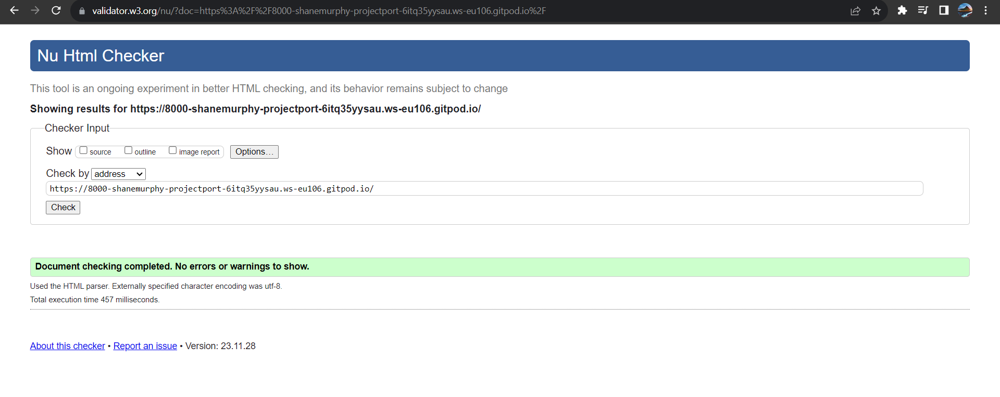

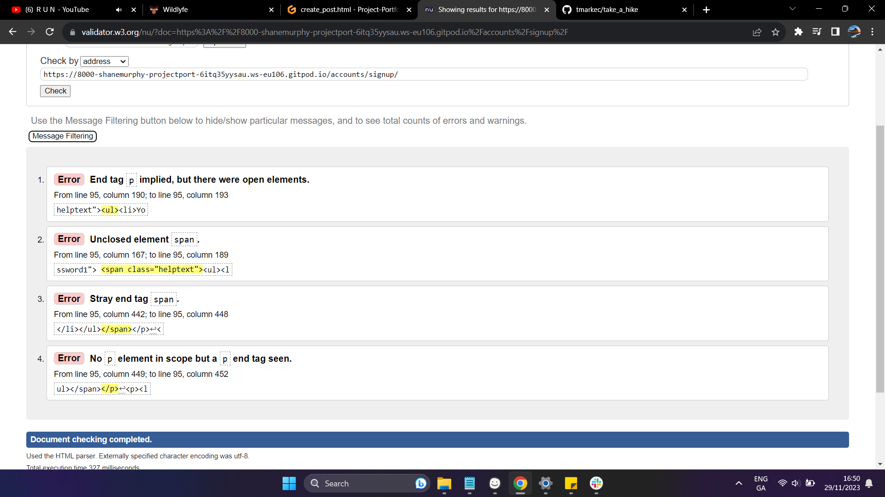

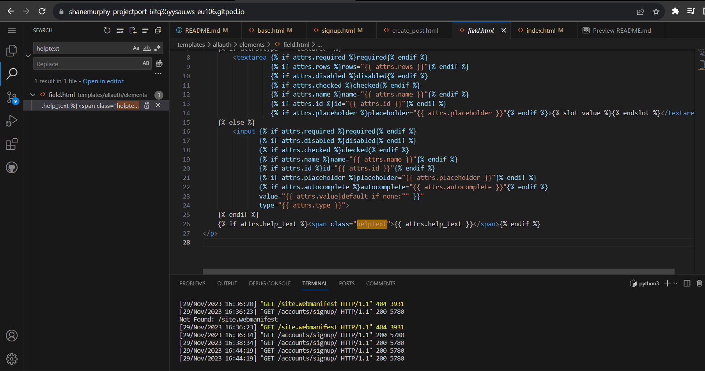

</details>

<details>
<summary>CSS Validation</summary>
<br>

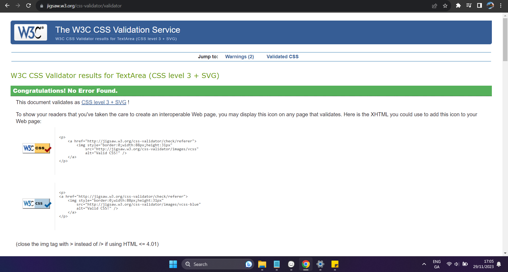

</details>

<details>
<summary>Python Validation</summary>
<br>

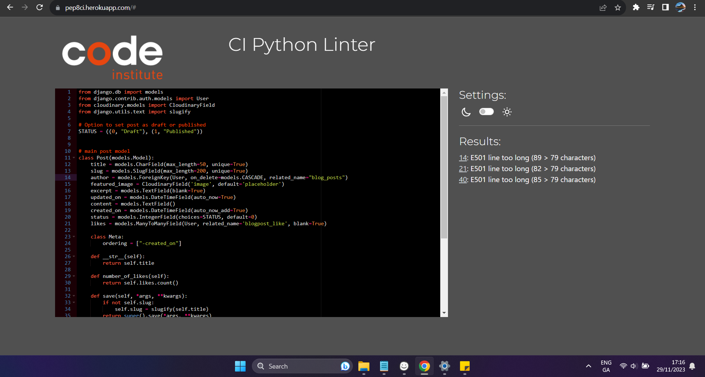
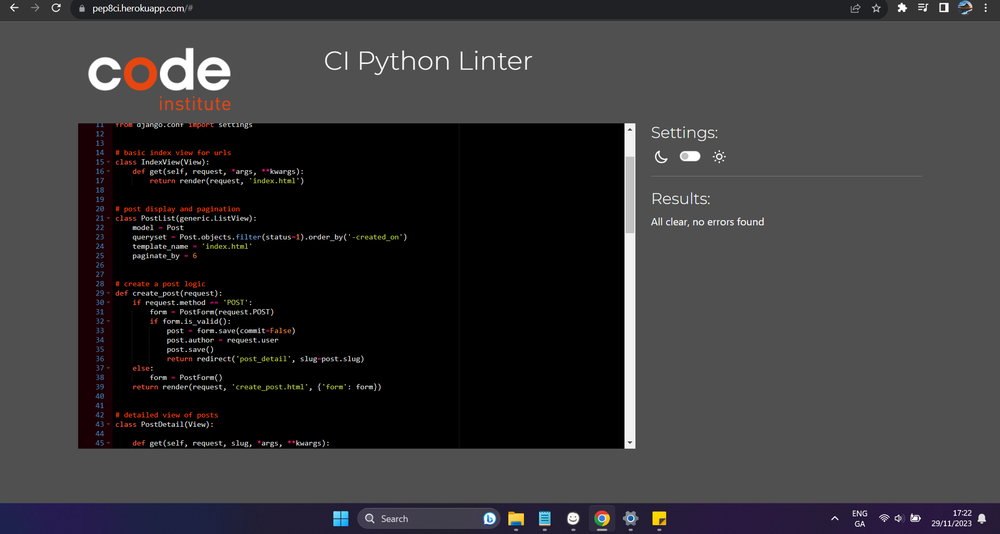
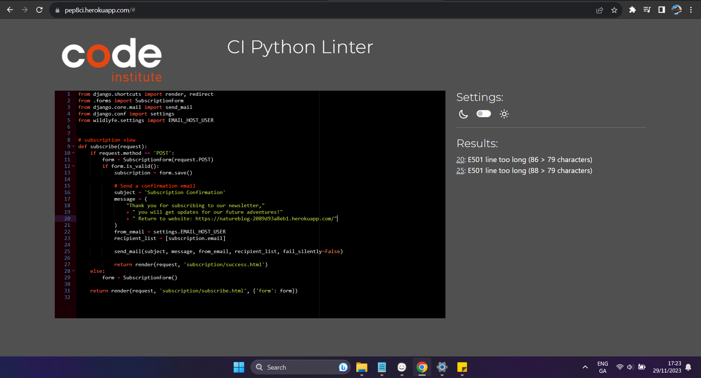
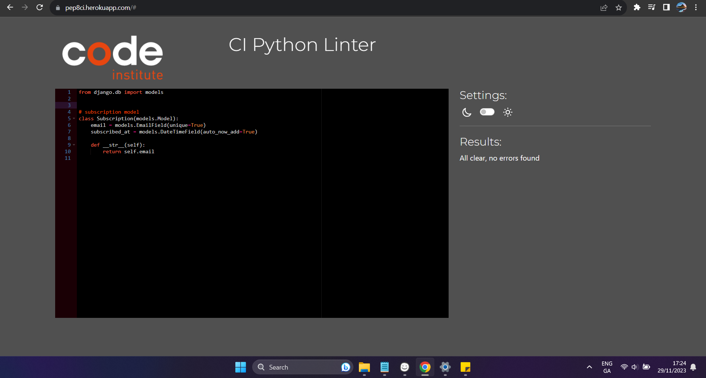

</details>


### Testing User Stories from User Experience (UX) Section

#### First Time Visitor Goals

1. As a First Time Visitor, I want to easily understand the main purpose of the site and learn more about the site.

    - Upon entering the site, users are automatically greeted with a clean and easily readable navigation bar to go to the page of their choice. Underneath there is a list of blog posts to cath the users attention.

    - The main points are made immediately with the posts

- - -

2. As a First Time Visitor, I want to be able to easily be able to navigate throughout the site to find content.

    - The site has been designed to be fluid and never to entrap the user. At the top of each page there is a clean navigation bar, each link describes what the page they will end up at clearly.

    - The page structure and post list is clearly defined.

    - The site and positive prompts and feed back pop ups for the user.

- - -

3. As a First Time Visitor, I want to look for blogs to understand what their users are posting. I also want to locate their social media links to see their following on social media to determine how trusted and known they are.

    - Once the new visitor has read the About Us, they will habe a good understanding of the sites intent and usage.

    - The user can also scroll to the bottom of any page on the site to locate social media links in the footer.

- - -

#### Returning Visitor Goals

1. As a Returning Visitor, I want to find the new posts and comments left by other users.

    - These are clearly shown in the post detail page..

2. As a Returning Visitor, I want to find the best way to get engaged with the community.

    - The navigation bar clearly highlights the each Page.

    - The footer contains links to the organisations Facebook, Twitter and Instagram page as well as the organization's email.

    - Whichever link they click, it will be open up in a new tab to ensure the user can easily get back to the website.

    - The subscribe button is set up to automatically goint to send the user a confirmatiom email.

3. As a Returning Visitor, I want to find the Facebook Group link so that I can join and interact with others in the community.

    - The Facebook Page can be found at the footer of every page and will open a new tab for the user and more information can be found on the Facebook page.

- - -

#### Frequent User Goals

1. As a Frequent User, I want to check to see if there are any newly posts, likes and comments.

    - The user would already be comfortable with the website layout and can easily click the banner message.


2. As a Frequent User, I want to check to see if there are any new blog posts.

    - The user would already be comfortable with the website layout and can easily click the blog link

3. As a Frequent User, I want to sign up to the Newsletter so that I am emailed any major updates and/or changes to the website or organisation.

    - At the bottom of every page their is a footer which content is consistent throughout all pages.

    - There is a "Submit" button for every form and is clearly detailed.

- - -

## Subscription Testing
<details>
<summary>Click here to view</summary>
<br>

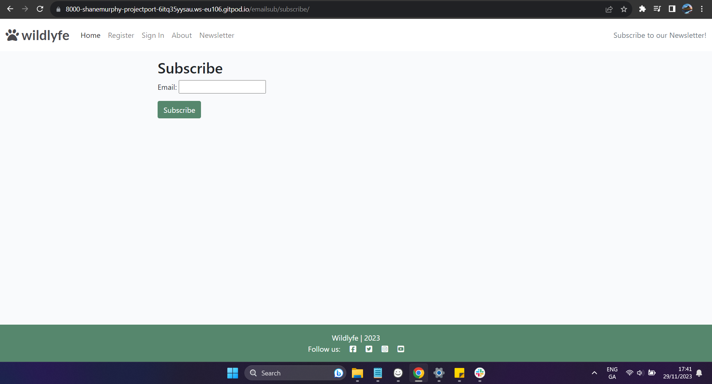

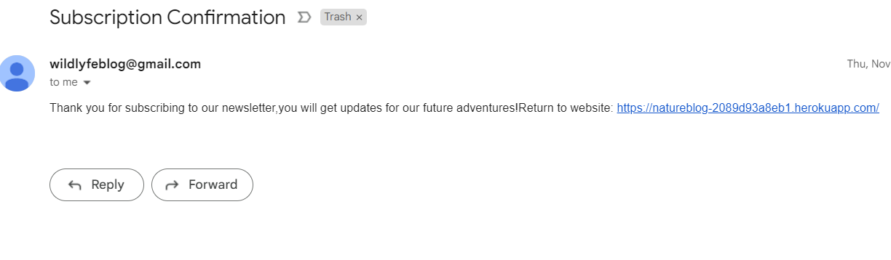

</details>

### Further Testing

-   The Website was tested on Google Chrome, Internet Explorer, Microsoft Edge and Safari browsers.

-   The website was viewed on a variety of devices such as Desktop, Laptop, iPhone7, iPhone 8 & iPhoneX.

-   A large amount of testing was done to ensure that all pages were linking correctly.

-   Friends and family members were asked to review the site and documentation to point out any bugs and/or user experience issues.

- - -

## Libraries
- asgiref - A standard Python library to allow for asynchronous web apps and servers to communicate with each other.
- cloudinary - A Python package allowing integration between the application and Cloudinary.
- dj-database-url - A Django utility to utilise the DATABASE_URL environment variable to configure the Django application. Used with PostgreSQL.
- dj3-cloudinary-storage - A Django package that facilitates integration with Cloudinary storage.
- Django - A python package for the Django framework.
- django-active-link - A Django package used to highlight an active link in the site navigation bars.
- django-allauth - An integrated set of Django applications addressing user authentication, registration and account management.
- django-summernote - is a third-party package that provides a rich text editor widget for Django web applications.
- django-crispy-forms - A Django package that provides tags and filters to control the rendering behaviour of Django forms. 
- gunicorn - A Python WSGI HTTP Server for UNIX.
- oauthlib - A generic, spec-compliant, thorough implementation of the OAuth request-signing logic for Python 3.6+.
- psycopg2 - A PostgreSQL database adapter for Python.
- PyJWT - A Python library that allows for encoding and decoding of JSON Web Tokens (JWT).
- python3-openid - A set of Python packages to support use of the OpenID decentralized identity system.
- requests-oauthlib - A Python package for OAuthlib authentication support for Requests.
- sqlparse - A non-validating SQL parser for Python.

## Deployment

### GitHub Pages

The project was deployed to GitHub Pages using the following steps...

1. Log in to GitHub and locate the [GitHub Repository](https://github.com/)

2. At the top of the Repository (not top of page), locate the "Settings" Button on the menu.
    - Alternatively Click [Here](https://raw.githubusercontent.com/) for a GIF demonstrating the process starting from Step 2.

3. Scroll down the Settings page until you locate the "GitHub Pages" Section.

4. Under "Source", click the dropdown called "None" and select "Master Branch".

5. The page will automatically refresh.

6. Scroll back down through the page to locate the now published site [link](https://github.com) in the "GitHub Pages" section.

- - -

### Making a Local Clone

1. Log in to GitHub and locate the [GitHub Repository](https://github.com/ShaneMurphyDev/Project-Portfolio-4)
2. Under the repository name, click "Clone or download".
3. To clone the repository using HTTPS, under "Clone with HTTPS", copy the link.
4. Open Git Bash
5. Change the current working directory to the location where you want the cloned directory to be made.
6. Type `git clone`, and then paste the URL you copied in Step 3.

```
$ git clone https://github.com/ShaneMurphyDev/Project-Portfolio-4
```

7. Press Enter. Your local clone will be created.

```
$ git clone https://github.com/ShaneMurphyDev/Project-Portfolio-4
> Cloning into `CI-Clone`...
> remote: Counting objects: 10, done.
> remote: Compressing objects: 100% (8/8), done.
> remove: Total 10 (delta 1), reused 10 (delta 1)
> Unpacking objects: 100% (10/10), done.
```
Click [Here](https://help.github.com/en/github/creating-cloning-and-archiving-repositories/cloning-a-repository#cloning-a-repository-to-github-desktop) to retrieve pictures for some of the buttons and more detailed explanations of the above process.


## Credits

### Code

-   Django User requests and interface/models tutorial [Here](https://docs.djangoproject.com/en/4.2/topics/class-based-views/generic-editing/#models-and-request-user)

-   [Bootstrap4](https://getbootstrap.com/docs/4.4/getting-started/introduction/): Bootstrap Library used throughout the project mainly to make site responsive using the Bootstrap Grid System.

-   [Slugs](https://learndjango.com/tutorials/django-slug-tutorial) : For setting up prepopulated slugs on the front end to 
improve UX

### Content

-   All content was written by the developer.

-   Color pallete from: [Cooler](https://coolors.co/)

### Media

-   All Images were taken from [Pixabay](https://pixabay.com/)

### Acknowledgements

-   My Mentor for continuous helpful feedback.

-   Tutor support at Code Institute for their support.